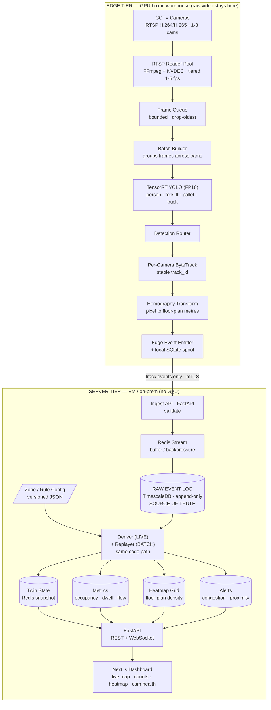
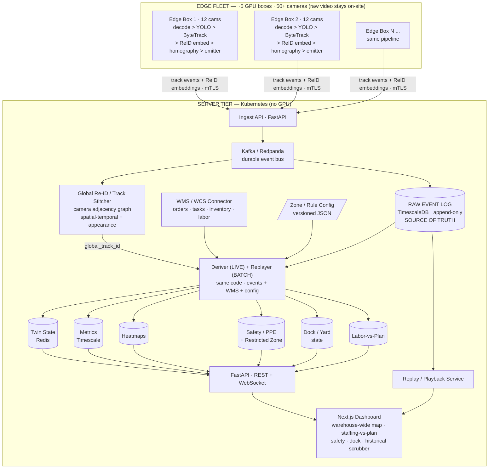

# Warehouse Digital Twin — Architecture Diagrams (Mermaid)

Render in any Mermaid-aware viewer (GitHub, VS Code Mermaid preview, mermaid.live).

---

## Phase 1 — Single Edge Box

---

## Phase 2 — Multi-Camera + WMS Integration

