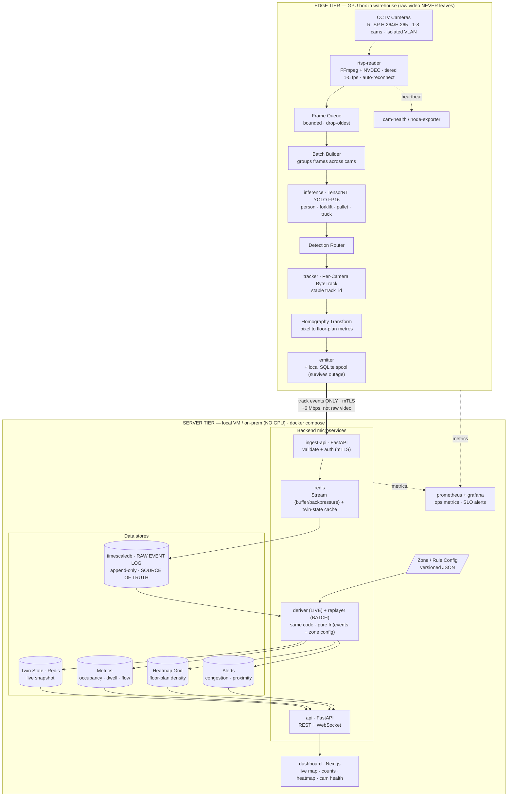

# Warehouse Digital Twin — Phase 1 Architecture (Production V1)

**Scope:** Phase 1 = "Operational Visibility" POC. One edge GPU box per facility, 1–8 cameras, single warehouse.
**Goal of V1:** Prove the core pipeline end-to-end on _real warehouse CCTV_ and produce a live, trustworthy operational map + dashboard. Everything here is buildable in ~8–10 weeks.

**Design rule for V1:** _Don't build the platform. Build the thinnest vertical slice that turns one real camera into a trustworthy live map, then widen to 8 cameras._ No multi-camera re-ID, no prediction, no robots — those are Phase 2/3.

---

## 1. What V1 must deliver (locked scope)

| Deliverable                          | In V1             | Notes                             |
| ------------------------------------ | ----------------- | --------------------------------- |
| Warehouse layout / floor plan        | ✅                | Pixel→floor homography per camera |
| Camera integration (RTSP)            | ✅                | Up to 8 cameras, 1 edge box       |
| Person detection                     | ✅                | Fine-tuned YOLO                   |
| Forklift detection                   | ✅                | Fine-tuned YOLO                   |
| Zone occupancy                       | ✅                | Per-zone live counts              |
| Worker density heatmaps              | ✅                | Floor-plan grid accumulation      |
| Congestion detection                 | ✅                | Density + dwell thresholds        |
| Live dashboard                       | ✅                | WebSocket, <2s latency            |
| Forklift-near-worker proximity alert | ✅ (bonus, cheap) | Single-camera only                |
| Cross-camera tracking / global ID    | ❌ Phase 2        | Each camera independent in V1     |
| PPE / restricted-zone / dock         | ❌ Phase 2        |                                   |
| Forecasting / simulation             | ❌ Phase 3        |                                   |

**Explicit non-goals:** no facial recognition, no per-individual identity, no replacement of safety officers. State this in writing — it de-risks privacy/labor conversations.

---

## 2. Core architectural decisions (and why)

1. **Edge does vision, server does intelligence.** Raw video never leaves the building. The edge box emits _structured track events only_. → solves bandwidth, privacy, and scale in one move. (This is the one good bone already in the original doc — we keep it.)
2. **The event log is the source of truth.** Append-only, immutable, timestamped events in TimescaleDB. Every derived view (metrics, twin state, heatmaps, alerts) is recomputable by replaying the log. Same code path runs LIVE and BATCH. → you can fix a zone polygon and re-derive history without re-watching video.
3. **World coordinates, not pixels.** Every track is projected to a shared floor-plan coordinate system via per-camera homography. Zones, occupancy, density, and proximity are all computed in metres on the floor plan — never in image space. → this is what makes it a _digital twin_ and not "boxes on a video."
4. **Single GPU box, batched inference.** One TensorRT engine serves all cameras via a batched frame queue. Decode on NVDEC (GPU), infer FP16, track on CPU. → one $2–4k box comfortably runs 8 cameras at 5 fps.
5. **Containerised, single-host compose for V1.** No Kubernetes yet. `docker compose up` is the deployable unit. → k8s is Phase 2 when you have N facilities.

---

## 3. System architecture

### 3.1 Rendered diagram (Mermaid) — edge + backend microservices



### 3.2 ASCII version (fallback for non-Mermaid viewers)

```
┌──────────────────────── EDGE TIER (in the warehouse, GPU box) ───────────────────────┐
│                                                                                       │
│  CCTV cameras ──RTSP──►  RTSP Reader Pool  ──►  Frame Queue  ──►  Batch Builder        │
│  (H.264/H.265)          (FFmpeg + NVDEC,        (bounded,         (groups frames       │
│   1080p, on VLAN)        1 thread/cam,           drop-oldest)      across cameras)      │
│                          tiered 1–5 fps)              │                 │              │
│                                                       ▼                 ▼              │
│                                          ┌──────────────────────────────────┐         │
│                                          │   TensorRT YOLO  (FP16, batched)  │         │
│                                          │   classes: person, forklift,      │         │
│                                          │            pallet, truck          │         │
│                                          └──────────────────────────────────┘         │
│                                                       │ detections                     │
│                                                       ▼                                 │
│                                    Detection Router ─► Per-Camera ByteTrack             │
│                                                       │ stable track IDs                │
│                                                       ▼                                 │
│                                    Homography Transform (pixel ► floor-plan metres)     │
│                                                       │                                 │
│                                                       ▼                                 │
│                                    Edge Event Emitter ─► TRACK EVENTS (JSON)            │
│                                                       │                                 │
│                              local SQLite spool (survives server outage)               │
└───────────────────────────────────────────────────────┼───────────────────────────────┘
                                                         │  events only (TLS, mTLS)
                                                         │  raw video stays in building
┌──────────────────────────── SERVER TIER (VM / on-prem, no GPU) ───────────────────────┐
│                                                                                        │
│   (1) Ingest API ──validate──►  Redis Stream  ──►  (2) RAW EVENT LOG                    │
│       (FastAPI)                 (buffer/backpressure)   append-only, TimescaleDB        │
│                                                          hypertable = SOURCE OF TRUTH   │
│                                                                │                        │
│                          ┌─────────────────────────────────────┤                        │
│                          ▼ LIVE                                  ▼ BATCH (replay)        │
│                   (3) Deriver  ◄──── Zone/Rule CONFIG (versioned JSON) ────►  Replayer   │
│                   zone geometry + rules           same logic both paths                 │
│                          │                                                              │
│          ┌───────────────┼───────────────┬───────────────────┐  (4) DERIVED STORES     │
│          ▼               ▼               ▼                   ▼                          │
│   Twin State        Metrics         Heatmap Grid          Alerts                        │
│  (Redis, live     (occupancy,      (floor-plan          (congestion,                    │
│   snapshot)        dwell, flow)     density buckets)      proximity)                     │
│          │               │               │                   │                          │
│          └───────────────┴───────┬───────┴───────────────────┘                          │
│                                   ▼                                                     │
│                       (6) FastAPI  REST + WebSocket                                     │
│                                   │                                                     │
│                                   ▼                                                     │
│                       (7) Next.js Dashboard                                            │
│                       live map · counts · heatmap · congestion · cam health            │
└────────────────────────────────────────────────────────────────────────────────────────┘
```

---

## 4. Edge tier — detailed

### 4.1 Box spec (recommended V1 hardware)

| Component  | Recommendation                                   | Why                                           |
| ---------- | ------------------------------------------------ | --------------------------------------------- |
| GPU        | NVIDIA RTX 4000 Ada (20 GB) or RTX A4000 (16 GB) | NVDEC + plenty of FP16 headroom for 8 cams    |
| Budget alt | RTX 4060 Ti 16GB / Jetson Orin NX 16GB           | Jetson if fanless/industrial enclosure needed |
| CPU        | 8-core (ByteTrack + decode orchestration)        | tracking is CPU-bound                         |
| RAM        | 32 GB                                            | frame queues + buffers                        |
| Disk       | 512 GB NVMe                                      | OS, models, event spool, optional clip cache  |
| OS         | Ubuntu 22.04 LTS                                 | NVIDIA driver 535+, CUDA 12.x                 |
| Runtime    | Docker + `nvidia-container-toolkit`              | reproducible deploy                           |
| Network    | 2 NICs: camera VLAN (isolated) + uplink          | cameras never touch the internet              |

### 4.2 Capacity math (why one box is enough)

- YOLO11m @ 640px, TensorRT FP16 on RTX 4000 Ada ≈ **3–5 ms/frame**.
- 8 cameras × 5 fps = **40 inferences/sec** → ~0.16–0.2 s of GPU compute per wall-clock second. **<20% GPU utilisation.**
- NVDEC decodes ~16–24× 1080p H.264 streams concurrently — decode is _not_ the bottleneck.
- **Tiered fps:** active zones (docks, aisles) at 5 fps; static zones at 1–2 fps. Halves load for free.
- **Headroom:** one box realistically sustains **12–16 cameras** at 5 fps; we cap V1 at 8 for safety margin.

### 4.3 Pipeline stages

1. **RTSP Reader Pool** — one FFmpeg subprocess per camera, `-hwaccel cuda -hwaccel_output_format cuda`, output rawvideo/NV12 frames. Auto-reconnect with exponential backoff (1s→30s) on stream drop. Emits camera-health heartbeat.
2. **Frame Queue** — bounded per-camera ring buffer (e.g. depth 3), **drop-oldest** policy. _Never block the decoder; a late frame is worthless in a live system._
3. **Batch Builder** — collects ready frames across cameras into a batch (max batch 8, max wait 20 ms) to maximise GPU throughput.
4. **TensorRT YOLO** — single shared FP16 engine. Classes: `person, forklift, pallet, truck`. Confidence floor 0.35, NMS IoU 0.5 (tune on warehouse val set).
5. **Detection Router** — splits batched detections back to source cameras.
6. **Per-Camera ByteTrack** — independent tracker per camera. Outputs stable `track_id` (scoped to camera in V1). Tune `track_buffer` for occlusion behind racking.
7. **Homography Transform** — apply per-camera 3×3 matrix to the _bottom-centre of each bbox_ (foot point) → floor-plan (x,y) in metres. Calibrated once per camera (see 4.4).
8. **Edge Event Emitter** — converts tracks into events; pushes to server over HTTPS/mTLS; spools to local SQLite if server unreachable, drains on reconnect.

### 4.4 Camera calibration (the unglamorous step that makes or breaks it)

For each camera, click **4+ known floor points** (rack corners, painted lines, dock markings) in the image and their real metres on the floor plan → solve homography `H` (OpenCV `findHomography`). Store in `cameras.json`. Re-foot-point projection error target: **< 0.5 m**. Without this, occupancy and proximity are garbage. Budget half a day per camera for V1.

---

## 5. Data contracts (schemas)

### 5.1 Track event (edge → server) — the _only_ thing on the wire

```json
{
  "schema": "track_event.v1",
  "event_id": "uuid",
  "camera_id": "cam-07",
  "track_id": 1423,
  "class": "forklift",
  "confidence": 0.91,
  "ts": "2026-06-16T11:02:33.412Z",
  "bbox_px": [x, y, w, h],
  "world_xy": [42.7, 18.3],
  "zone": "Aisle-C",
  "velocity_mps": 1.6
}
```

Note the three fields the original doc was missing: **`ts`, `camera_id`, `track_id`** — without them nothing is queryable.

### 5.2 Derived events (server, written to log)

```json
{ "schema":"occupancy.v1", "zone":"Picking Area", "count":23, "ts":"..." }
{ "schema":"congestion.v1", "zone":"Packing Area", "severity":"high", "density":0.42, "ts":"..." }
{ "schema":"proximity.v1", "worker_track":88, "forklift_track":1423, "dist_m":1.4, "zone":"Aisle-C", "ts":"..." }
{ "schema":"dwell.v1", "zone":"Dock-Staging", "track_id":88, "dwell_s":312, "ts":"..." }
```

### 5.3 Zone config (versioned, the only "tuning" surface)

```json
{
  "version": 7,
  "floor_plan": "warehouse-A.svg",
  "scale_m_per_unit": 1.0,
  "zones": [
    {
      "id": "Aisle-C",
      "type": "aisle",
      "polygon": [
        [40, 12],
        [46, 12],
        [46, 30],
        [40, 30]
      ],
      "congestion_density_threshold": 0.35,
      "max_occupancy": 8
    }
  ],
  "rules": [
    {
      "id": "forklift_near_worker",
      "type": "proximity",
      "a": "forklift",
      "b": "person",
      "distance_m": 2.0,
      "severity": "high"
    }
  ]
}
```

---

## 6. Server tier — derivation logic

All derivers consume the raw event log and are **pure functions of (events + zone config)** — that's what lets LIVE and BATCH share code.

- **Occupancy** = count of distinct `track_id`s whose `world_xy` ∈ zone polygon, smoothed over a 5–10 s sliding window (kills flicker from detection gaps).
- **Heatmap** = floor plan rasterised into a grid (e.g. 0.5 m cells); each worker position increments its cell with time-decay. Served as a normalised density array.
- **Congestion** = (occupancy / zone area) > `congestion_density_threshold` AND sustained > N seconds. Two-level: `warning` / `high`. Dwell-aware so a brief crowd doesn't alarm.
- **Proximity / near-miss** = for each forklift, nearest person distance in world coords < rule threshold → alert. Single-camera only in V1 (both objects must be in the same frame).
- **Twin state** = current snapshot in Redis (`zone → counts`, `track → world_xy/class`), pushed to the dashboard over WebSocket at 2–4 Hz.

**Latency budget (camera glass → dashboard pixel): target < 2 s.**
decode+sample ≤ 200 ms · inference ≤ 50 ms · track+transform ≤ 50 ms · network ≤ 100 ms · derive+push ≤ 300 ms. Comfortable.

---

## 7. Storage & retention

| Store                | Tech                              | Retention (V1)                             |
| -------------------- | --------------------------------- | ------------------------------------------ |
| Raw event log        | TimescaleDB hypertable            | 90 days, then continuous-aggregate rollups |
| Twin state (live)    | Redis                             | ephemeral (rebuilt from log)               |
| Metrics / aggregates | TimescaleDB continuous aggregates | 12 months                                  |
| Heatmap grids        | Redis (live) + Timescale (hourly) | live + 12 months hourly                    |
| Optional clip cache  | Local disk on edge                | 7 days, ring buffer (only on alert)        |

Events are tiny (~300 bytes). 8 cams × ~40 events/s ≈ 100 MB/day raw — trivial.

---

## 8. Deployment (single-host compose, V1)

```
edge-box/                          server-vm/
  docker-compose.yml                 docker-compose.yml
  ├─ rtsp-reader  (FFmpeg/NVDEC)      ├─ ingest-api   (FastAPI, mTLS)
  ├─ inference    (TensorRT/YOLO)     ├─ redis        (stream + twin state)
  ├─ tracker      (ByteTrack)         ├─ timescaledb  (event log)
  ├─ emitter      (events + spool)    ├─ deriver      (live + replayer)
  └─ node-exporter / cam-health       ├─ api          (REST + WebSocket)
                                       ├─ dashboard    (Next.js)
                                       └─ prometheus + grafana
```

- **Edge** needs `runtime: nvidia` + driver + container toolkit. Everything else is CPU.
- **One `.env`** per site holds camera URLs, mTLS certs, site_id.
- **Updates:** pin image tags; `docker compose pull && up -d`. Model swaps are a TensorRT engine file + a config version bump.

---

## 9. Reliability & failure handling (the senior-engineer checklist)

- **Camera drops** → FFmpeg auto-reconnect (backoff), `cam-health` flips red on dashboard after 10 s silence.
- **Server unreachable** → edge spools events to local SQLite, drains in order on reconnect. No data loss for short outages.
- **GPU OOM / inference crash** → supervised by Docker `restart: unless-stopped` + healthcheck; batch size capped; frame queue drops rather than grows.
- **Clock skew** → edge stamps `ts` from NTP-synced clock; server rejects events >60 s in the future.
- **Backpressure** → Redis Stream + bounded queues everywhere; system sheds frames, never memory-bombs.
- **Bad calibration / drift** → periodic re-projection sanity check; alert if foot-points cluster off-plan.
- **Idempotency** → `event_id` UUID dedupes replays after a reconnect.

## 10. Security & privacy (write it down now)

- Cameras on **isolated VLAN**, no inbound internet, no cloud.
- Edge→server over **mTLS**; dashboard over **TLS + auth (RBAC: viewer/manager/admin)**.
- **No identity, no faces** — only anonymous track IDs that reset; positions, not people.
- Document **retention + lawful basis**; loop in works council / safety officer before "idle time" style metrics. Defer per-person productivity scoring to a later, reviewed phase.

## 11. Models & data plan (don't skip — it's the long pole)

1. **Start** from YOLO11m (or YOLOv8m) COCO weights — gets you `person`/`truck` day one.
2. **Collect** 2–4k frames from the _actual_ cameras (angles, lighting, IR/night, occlusion behind racking).
3. **Label** `person, forklift, pallet, truck` (CVAT / Roboflow). Forklifts especially need custom data — COCO has none.
4. **Fine-tune**, export → ONNX → **TensorRT FP16** engine for the target GPU.
5. **Accept** against a held-out warehouse val set: person mAP ≥ 0.85, forklift mAP ≥ 0.80, ID-switch rate low, false-proximity-alert budget defined. **No accuracy bar = no trust = dead pilot.**
6. **Feedback loop:** dashboard "flag wrong detection" button → mislabel queue → periodic retrain.

## 12. Observability

- **Prometheus metrics:** per-camera fps in/out, queue depth, inference ms, GPU util/mem, events/s, end-to-end latency, reconnect count.
- **Grafana** ops dashboard + alerts (camera down, latency > 2 s, GPU > 90 %, event-log write lag).
- This is separate from the _business_ dashboard — ops vs. operations.

## 13. KPIs for the pilot (with baselines — fill from week-1 measurement)

| KPI                                      | Baseline         | V1 target |
| ---------------------------------------- | ---------------- | --------- |
| Occupancy accuracy (vs manual count)     | TBD              | ≥ 95 %    |
| Glass-to-dashboard latency               | —                | < 2 s     |
| Camera uptime                            | —                | ≥ 99 %    |
| Person detection mAP                     | —                | ≥ 0.85    |
| Forklift detection mAP                   | —                | ≥ 0.80    |
| False congestion alerts / shift          | —                | < 3       |
| Time-to-detect a staged congestion event | minutes (manual) | < 15 s    |

## 14. Realistic timeline (~8–10 weeks)

| Wk   | Milestone                                                             |
| ---- | --------------------------------------------------------------------- |
| 1    | Edge box provisioned, 1 camera RTSP pulling, frames decoding on NVDEC |
| 2    | YOLO COCO inference + ByteTrack live on 1 camera                      |
| 3    | Data collection + labeling starts; homography calibration tool        |
| 4    | Fine-tuned model → TensorRT; event emitter + Timescale log            |
| 5    | Deriver: occupancy + zones; basic dashboard with live map             |
| 6    | Heatmap + congestion + proximity; WebSocket live push                 |
| 7    | Scale to 4–8 cameras; reliability (reconnect, spool, health)          |
| 8    | Accuracy validation vs manual ground truth; tuning                    |
| 9–10 | Hardening, security, ops dashboards, pilot sign-off                   |

## 15. Tech stack summary

**Edge:** Ubuntu 22.04 · NVIDIA 535+/CUDA 12 · Docker + nvidia-container-toolkit · FFmpeg (NVDEC) · YOLO11/YOLOv8 (Ultralytics) · TensorRT FP16 · ByteTrack · OpenCV (homography) · Python asyncio · SQLite (spool).
**Server:** FastAPI · Redis (Streams + state) · TimescaleDB (Postgres 16) · Python derivers · Next.js + WebSocket · Prometheus + Grafana · Docker Compose.

---

### The one-paragraph pitch

> Phase 1 turns one warehouse's existing CCTV into a live operational map. Each camera's video is processed _on-site_ by a single GPU box — detect (YOLO/TensorRT), track (ByteTrack), and project onto the floor plan — emitting only tiny anonymous track events. A server replays those events against versioned zone rules to compute live occupancy, density heatmaps, congestion, and forklift-near-worker alerts, streamed to a dashboard in under two seconds. Raw video never leaves the building. It's the thinnest honest slice of a digital twin: real, accurate, and the foundation every later phase replays its history from.
