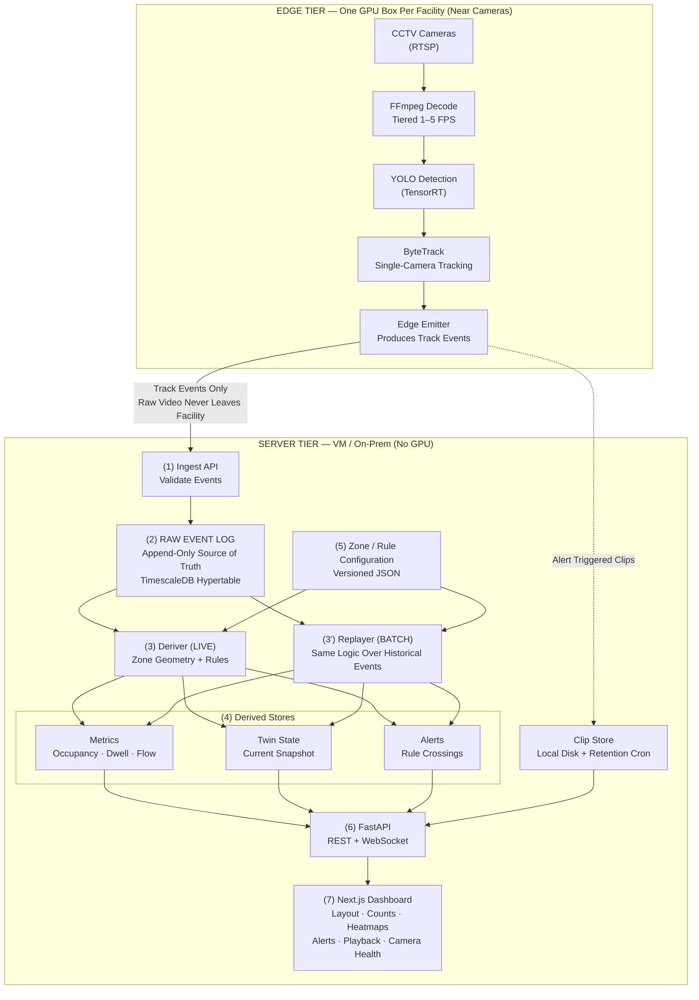

# Warehouse Digital Twin Architecture

```mermaid
flowchart TB
    subgraph EDGE["EDGE TIER — One GPU Box Per Facility (Near Cameras)"]
        CAM["CCTV Cameras<br/>(RTSP)"]
        FF["FFmpeg Decode<br/>Tiered 1–5 FPS"]
        YOLO["YOLO Detection<br/>(TensorRT)"]
        BT["ByteTrack<br/>Single-Camera Tracking"]
        EM["Edge Emitter<br/>Produces Track Events"]

        CAM --> FF --> YOLO --> BT --> EM
    end

    subgraph SERVER["SERVER TIER — VM / On-Prem (No GPU)"]
        ING["(1) Ingest API<br/>Validate Events"]

        LOG["(2) RAW EVENT LOG<br/>Append-Only Source of Truth<br/>TimescaleDB Hypertable"]

        DER["(3) Deriver (LIVE)<br/>Zone Geometry + Rules"]

        REP["(3') Replayer (BATCH)<br/>Same Logic Over Historical Events"]

        CFG["(5) Zone / Rule Configuration<br/>Versioned JSON"]

        subgraph DERIVED["(4) Derived Stores"]
            MET["Metrics<br/>Occupancy · Dwell · Flow"]
            STATE["Twin State<br/>Current Snapshot"]
            ALERTS["Alerts<br/>Rule Crossings"]
        end

        API["(6) FastAPI<br/>REST + WebSocket"]

        UI["(7) Next.js Dashboard<br/>Layout · Counts · Heatmaps<br/>Alerts · Playback · Camera Health"]

        CLIPS["Clip Store<br/>Local Disk + Retention Cron"]

        ING --> LOG

        LOG --> DER
        LOG --> REP

        CFG --> DER
        CFG --> REP

        DER --> MET
        DER --> STATE
        DER --> ALERTS

        REP --> MET
        REP --> STATE
        REP --> ALERTS

        MET --> API
        STATE --> API
        ALERTS --> API

        CLIPS --> API

        API --> UI
    end

    EM -->|"Track Events Only<br/>Raw Video Never Leaves Facility"| ING

    EM -.->|"Alert Triggered Clips"| CLIPS
```
